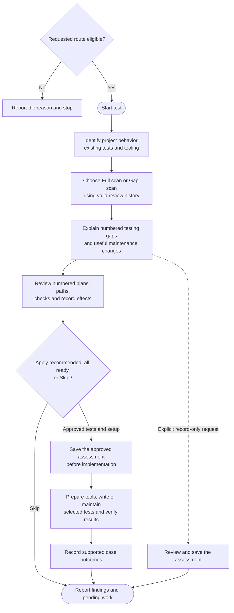

# Test



Test turns gaps in protection into cases you can review and choose. It can improve existing tests as well as add new ones, while keeping assessment, implementation and verified results distinct.

## Flow

```mermaid
flowchart TD
  Entry{"Requested route eligible?"} -->|No| Blocked["Report the reason and stop"]
  Entry -->|Yes| Start
  Start(["Start test"]) --> Inspect["Identify project behavior,<br/>existing tests and tooling"]
  Inspect --> Scope["Choose Full scan or Gap scan<br/>using valid review history"]
  Scope --> Assess["Explain numbered testing gaps<br/>and useful maintenance changes"]
  Assess --> Select["Review numbered plans, paths,<br/>checks and record effects"]
  Select --> Choice{"Apply recommended, all ready,<br/>or Skip?"}
  Choice -->|Skip| End(["Report findings and pending work"])
  Choice -->|Approved tests and setup| Checkpoint["Save the approved assessment<br/>before implementation"]
  Assess -.->|Explicit record-only request| Record["Review and save the assessment"]
  Record --> End
  Checkpoint --> Work["Prepare tools, write or maintain<br/>selected tests and verify results"]
  Work --> Evidence["Record supported case outcomes"]
  Evidence --> End
```

## Start the command

Normal test checks for clean main/master, an established feature or maintenance branch, or a confirmed environment branch before source/test inventory. An explicitly requested read-only source assessment can inspect pending edits without project execution, ledger access or fixes. The workflow preserves unrelated work instead of stashing it to make room.

Existing assessment records are validated before the normal source inventory. Where needed, one helper read can validate a record and return a useful index together. An absent record needs no parser setup until an approved first write requires validation; the agent does not build a replacement validator during the review. Unsupported or malformed records end the run without a source-only fallback. A failed prerequisite stops the run, including further assessment or planning. A later setup, verification or checkpoint failure preserves completed assessments and actual drafts without continuing other work. An unanswered workflow question pauses the run; it does not authorize independent investigation while you decide.

## Choose the review scope

A Full scan assesses behavior and the protection provided by existing tests. A Gap scan starts from a valid earlier assessment, follows changed behavior and consumers, and revisits affected findings across open, resolved and obsolete states. Older open backlog remains visible, with unchanged records outside the review distinguished from current assessments. A first run or an unusable baseline may need Full scan.

The assessment asks what could go wrong and whether a test would detect it. Counts and coverage percentages alone cannot answer that. A passing test can still assert the wrong thing or never reach the important failure path.

Before presenting a need as new, test compares it with relevant recorded guarantees, evidence and protecting tests. A changed title, moved file or different explanation does not by itself make a different finding. Several tests may address one guarantee; a genuine split into separate needs is explained with its old-to-new mapping. Matching records keep their identity rather than returning as new issues under new wording.

## What kinds of tests can it suggest?

Suggestions follow the actual stack and risk: unit cases, integration checks, accessibility behavior, fixtures, runner repairs or a different testing technique when it serves the project.

Existing tests can be clarified or consolidated. Removing one needs evidence that its behavior is obsolete or remains protected elsewhere. A failing assertion is not permission to weaken the guarantee.

For example, a payment retry case should verify the externally important outcome, such as avoiding a duplicate charge. Repeating each internal helper call in an assertion can make the test brittle without protecting that outcome.

## Review findings and choose changes

The report leads with the finding count and the actual review scope and limits. Each numbered item has a short title and usually one or two sentences explaining what the current tests could miss, the consequence and what the proposed change would establish. Related findings can be grouped by behavior, and one finding can require several test functions. There is no priority table or implementation-code dump.

For example, “Retrying enrolment could create a duplicate enrolment” should explain whether current tests exercise a repeated request and that the proposed test would check that only one enrolment exists afterward. That tells you the protection being proposed without requiring you to inspect how the test will be written. The report identifies continuing or reopened findings so they are not presented as new discoveries.

Recommendations consider whether the finding is a current problem, a conditional risk or an improvement. Expected protection or maintenance benefits are weighed against effort, setup and execution needs, compatibility, fragility and future upkeep, using existing coverage and confidence in the intended behavior. Short- and long-term effects matter when they differ. You get the deciding reason and material tradeoff, without a score or a checklist of every factor. Optional maintenance can be recommended when it earns its cost; a serious concern can remain pending when its intended outcome or safe execution is unresolved.

The actions show exact finding numbers or ranges:

- **Apply recommended:** approve the displayed ready work whose benefits justify its tradeoffs.
- **Apply all ready changes:** approve every displayed ready proposal, including optional maintenance. When this matches Recommended, only All is shown; an empty Apply action is omitted.
- **Skip:** make no new edits, run no new test/setup commands and write no assessment record. Earlier accepted work is preserved.

Type numbers, ranges, exclusions or a requested revision directly when neither Apply set fits. There is no separate Choose cases or Revise menu option. A custom scope choice needs its resulting concrete plan reviewed, including dependencies and replacement guarantees; an unchanged complete Apply plan needs no repeated approval. Unknown intent, execution blockers, manual work and production repairs are explained beside the findings and stay outside ready Apply sets until their required decisions are resolved.

A concise execution note supplies paths, setup, checks and targets, meaningful verification limits, commit units and record effects before approval. It reuses the finding explanations rather than repeating them as a long implementation plan. Large reports start with a numbered index and explain manageable groups, keeping their numbers stable. Apply covers only changes with a displayed ready plan, never unseen later batches. The assessment checkpoint still needs its findings and effects disclosed before it is approved.

The approved assessment saves all meaningful findings reviewed in scope before implementation, including those not selected for test changes. An explicit request to record the assessment without test changes can use its own record-only approval; Skip does not trigger that question or mark anything fixed. The existing ledger format and historical priority metadata remain compatible, while recommendations use the current benefits and tradeoffs. Approval does not cover unknown later diffs, commits or separately required intrusive execution.

## Tools and verification

Existing tools come first. Runner setup, installations, upgrades and database or service effects need to be part of the approved plan. An apparently local test command can still run hooks, contact a service or reset data, so the actual entrypoint and target matter.

Work proceeds in coherent groups of cases. Failed, unavailable or deferred required checks keep those cases unverified. Approved additive drafts may remain uncommitted when the required verification cannot run. Coverage claims need measurements, and a failed case can reveal production work outside the testing task.

## Your result and the next run

The report separates the assessment, test changes, measured results and remaining work. Saved findings preserve decisions and useful closed history; deferred, skipped and accepted-risk cases do not count as verified protection.

Status records what was established in its context. An open case is reassessed when relevant: it may still need work, now have adequate protection, or no longer apply. A resolved case is checked when related changes or a matching observation put its guarantee in question; proven loss of protection reopens that same case. An obsolete case can return when its original requirement returns. A file edit or unavailable runner alone cannot determine any of these outcomes, and an old passing result never becomes a current pass automatically. Earlier deferral decisions are reused only while their context still holds.

Records keep concise guarantees, evidence references, actual decisions and supported closures. The helper returns bounded index pages and relevant full records across all states, avoiding a full ledger dump into each review. Path and wording changes can require different focused lookups; an empty narrow search is not proof that the issue is new. Unrelated closed history is not reassessed on every Gap scan. Paging reduces review context, while complete structural validation still has a cost and preserves its resource limits.

The ledger holds current judgments; Git retains prior versions. It does not accumulate full logs, repeated run summaries or every existing test. Useful closed records and unknown fields remain preserved, and size alone never authorizes deleting them or rewriting their evidence. Later runs can continue from this history without pretending the whole project was reassessed.

Changes finish locally on the same branch. [Refactor](../refactor.html#refactor-vs-test) owns behavior-preserving source improvements; neither workflow invokes the other automatically.

## Explore the source

For implementation details, read [guides/test.md](https://github.com/myowinthein/agent-helm/blob/main/guides/test.md).
